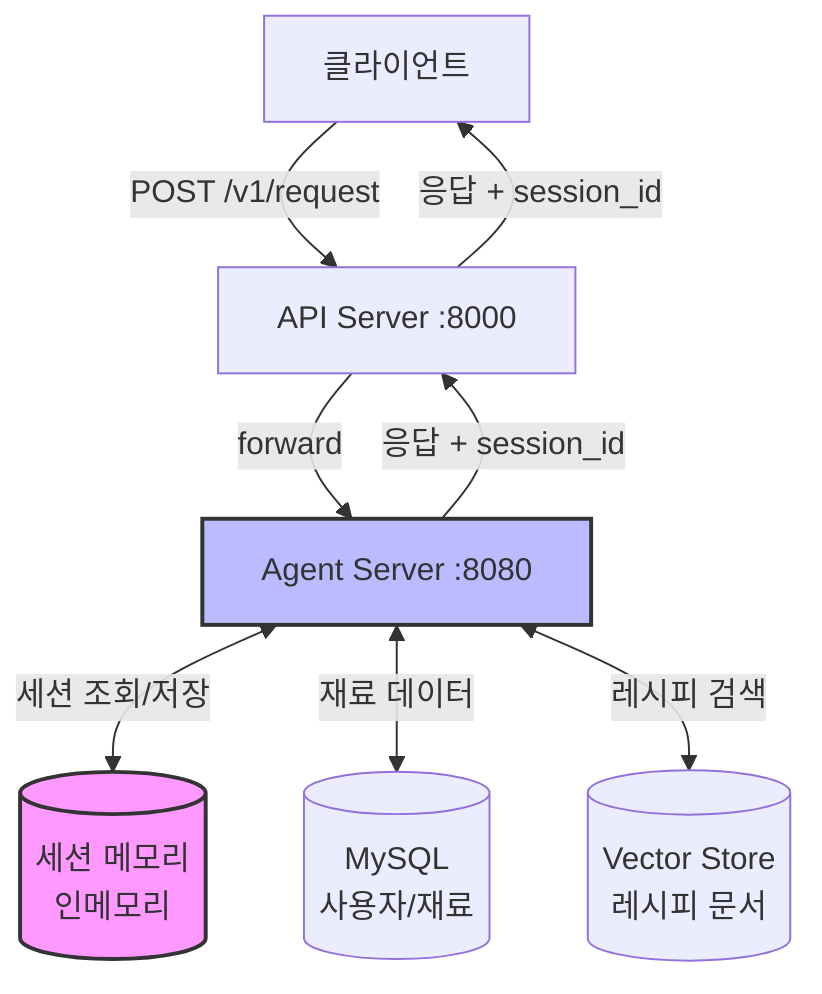
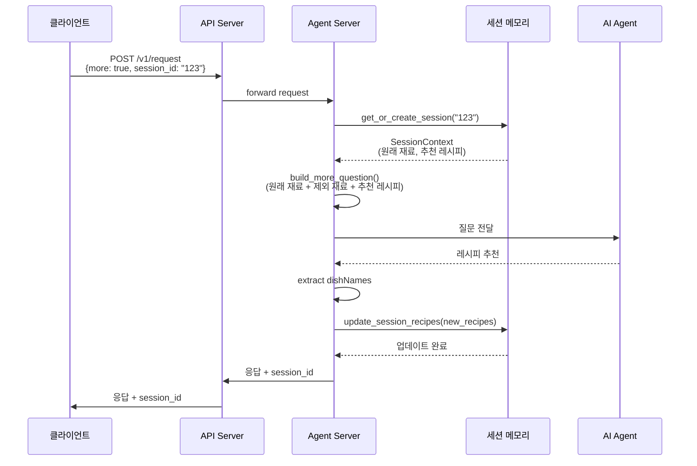
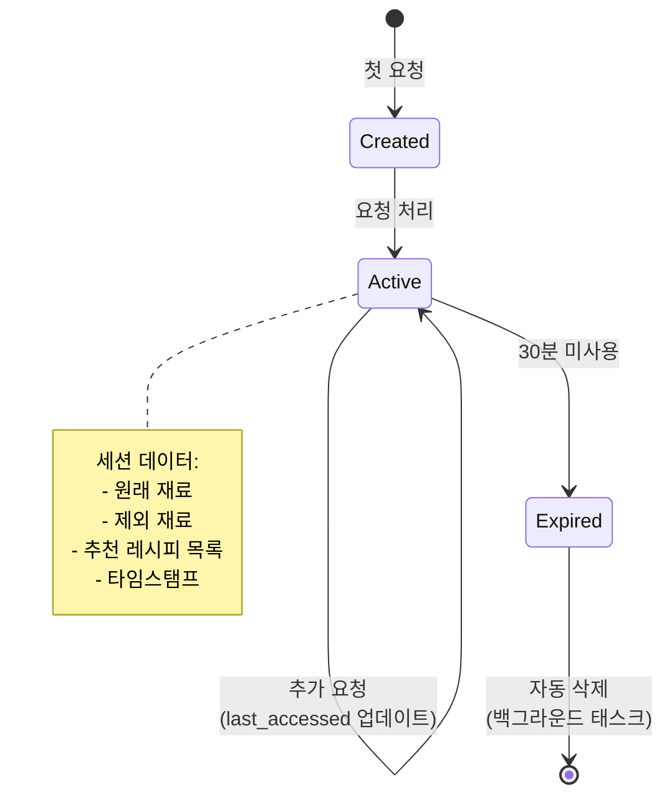

# 구현 요약: 메모리 기반 추가 레시피 추천 기능

**브랜치**: `001-memory-recommendations`
**작성일**: 2026-02-16
**상태**: 완료

---

## 기능 개요

사용자가 레시피 추천을 받은 후 `more=true` 파라미터를 사용하여 추가 추천을 요청할 수 있는 기능을 구현했습니다. 이 기능은 대화 컨텍스트를 메모리에 저장하여 사용자가 원래 입력한 재료 목록과 제외 조건을 다시 입력하지 않아도 되도록 합니다. 또한 이전에 추천받은 레시피는 자동으로 제외되어 다양한 추천을 받을 수 있습니다.

### 핵심 가치

- **사용자 경험 개선**: 재료를 반복해서 입력할 필요 없이 "더 추천해줘"라고 요청 가능
- **컨텍스트 유지**: 원래 재료 목록과 제외 조건을 세션 메모리에 보관
- **중복 방지**: 이미 추천받은 요리는 자동으로 제외
- **자동 정리**: 30분간 미사용 세션은 자동으로 삭제되어 메모리 관리

---

## 완료된 작업 목록

### Phase 1: 설정 (3개 작업)
- ✅ T001: pytest, pytest-asyncio, freezegun을 requirements.txt에 추가
- ✅ T002: util/memory/ 디렉토리 생성
- ✅ T003: tests/unit/ 및 tests/integration/ 디렉토리 생성

### Phase 2: 기반 인프라 (10개 작업)
- ✅ T004-T005: RequestBody 및 AgentRequestBody에 session_id 필드 추가
- ✅ T006: session_store.py에 세션 메모리 데이터 구조 생성
- ✅ T007-T010: 세션 생성, 조회, 업데이트, 정리 함수 구현
- ✅ T011-T013: agent_server.py에 세션 메모리 임포트 및 백그라운드 정리 태스크 추가

### Phase 3: 사용자 스토리 1 - 메모리 기반 추가 추천 (13개 작업)
- ✅ T014-T016: api_server.py에서 session_id 처리 및 전달
- ✅ T017-T020: agent_server.py에서 세션 조회 및 초기화 로직
- ✅ T021-T022: more=true 요청을 위한 질문 생성 함수 구현
- ✅ T023-T026: 응답에서 레시피명 추출 및 세션 업데이트, 응답에 session_id 포함

### Phase 4: 사용자 스토리 2 - 이전 추천 레시피 제외 (4개 작업)
- ✅ T027-T030: build_more_question에 이전 추천 레시피 제외 로직 추가

### Phase 5: 사용자 스토리 3 - 세션 메모리 유지 (4개 작업)
- ✅ T031-T034: 세션 만료 검증, 통계 로깅, last_accessed 타임스탬프 업데이트

### Phase 6: 엣지 케이스 처리 (9개 작업)
- ✅ T035-T043: 빈 결과 처리, session_id 검증, 에러 핸들링, 하위 호환성 검증

### Phase 7: 문서화 및 최종 검증 (7개 작업)
- ✅ T044-T050: Docstring 추가, 주석 작성, 통합 테스트, 코드 리뷰

**총 50개 작업 완료**

---

## 변경/생성된 파일

### 새로 생성된 파일
- `util/memory/session_store.py` - 세션 메모리 관리 핵심 로직
- `tests/unit/` - 유닛 테스트 디렉토리
- `tests/integration/` - 통합 테스트 디렉토리
- `requirements.txt` - 테스팅 라이브러리 추가

### 수정된 파일
- `api_server.py` - session_id 파라미터 처리 및 전달
- `agent_server.py` - 세션 메모리 통합, more=true 로직 구현
- `util/request/request_body.py` - RequestBody에 session_id 필드 추가
- `util/request/agent_request_body.py` - AgentRequestBody에 session_id 필드 추가
- `util/request/agent_request_additional_format.txt` - more=true 프롬프트 포맷 문서화

---

## 주요 변경사항

### 1. 세션 메모리 시스템 (`util/memory/session_store.py`)

인메모리 세션 저장소를 구현하여 대화 컨텍스트를 관리합니다.

**핵심 데이터 구조**:
```python
SessionContext = {
    "session_id": str,                    # 세션 고유 ID
    "original_ingredients": List[str],    # 최초 요청 재료 목록
    "original_exclusions": List[str],     # 최초 요청 제외 재료
    "recommended_recipes": List[str],     # 추천받은 요리명 목록
    "last_accessed": float,               # 마지막 접근 시간
    "created_at": float                   # 생성 시간
}
```

**주요 함수**:
- `create_session()` - 새 세션 생성
- `get_or_create_session()` - 기존 세션 조회 또는 신규 생성
- `update_session_recipes()` - 추천된 레시피명 추가 (비동기, 락 사용)
- `cleanup_expired_sessions()` - 30분 이상 미사용 세션 자동 삭제 (5분 간격)

**동시성 제어**:
- 세션별 asyncio.Lock을 사용하여 동시 업데이트 방지
- 읽기는 락 없이 수행 (Python dict의 원자성 활용)

### 2. API 엔드포인트 변경 (`api_server.py`, `agent_server.py`)

**요청 구조 확장**:
```json
{
    "ingredients": ["양파", "소시지", "토마토"],
    "excludeIngredients": ["마늘"],
    "more": true,
    "session_id": "user-123"  // 새로 추가
}
```

**응답 구조 확장**:
```json
{
    "answer": [...],
    "session_id": "user-123"  // 새로 추가
}
```

### 3. more=true 요청 처리 로직 (`agent_server.py`)

**요청 흐름**:
1. `session_id`로 기존 세션 조회 또는 신규 생성
2. `more=false` (일반 요청):
   - 현재 요청의 재료와 제외사항을 세션에 저장
3. `more=true` (추가 추천 요청):
   - 세션에서 원래 재료 목록 및 이전 추천 레시피 목록 조회
   - 새로운 제외 재료와 결합
   - AI 에이전트에 전달할 질문 생성:
     ```
     이전 질문의 조건들을 동일하게 적용해서 다른 요리 더 추천해줘.

     원래 재료: 양파, 소시지, 토마토

     대신 아래 재료들은 빼줬으면 좋겠어:
     마늘

     그리고 이미 추천한 요리는 제외해줘:
     소시지 토마토 볶음, 토마토 스파게티
     ```
4. AI 응답에서 `dishName` 추출하여 세션의 `recommended_recipes`에 추가
5. 응답에 `session_id` 포함하여 반환

### 4. 자동 메모리 정리 (`agent_server.py` startup)

```python
@app.on_event("startup")
async def startup_event():
    asyncio.create_task(cleanup_expired_sessions())
```

- 서버 시작 시 백그라운드 태스크 실행
- 5분마다 30분 이상 미사용 세션 삭제
- 이모지 로깅: ✨ (생성), 🧹 (정리), 📝 (업데이트), 📊 (통계)

### 5. 하위 호환성

- 모든 새 필드는 optional (기본값 제공)
- `session_id` 없는 요청도 정상 작동 (자동 생성)
- `more` 파라미터 없는 요청도 정상 작동 (기본값 false)
- 기존 클라이언트는 수정 없이 계속 사용 가능

---

## 아키텍처 다이어그램

### 시스템 구조



### 데이터 흐름 (more=true 요청)



### 세션 생명주기



---

## 테스트 커버리지

### 구현된 테스트

현재 기능의 테스트는 **수동 통합 테스트**로 수행되었습니다:

1. **T047**: 일반 요청 → more 요청 → 다른 레시피 반환 검증
2. **T048**: more=true이지만 session 없을 때 → 일반 요청으로 처리 검증
3. **T049**: 30분 후 세션 만료 검증
4. **T050**: 코드 리뷰 - 이모지 로깅 패턴 일관성 검증

### 테스트 디렉토리 구조

```
tests/
├── unit/              # 유닛 테스트 (향후 추가 가능)
│   └── test_session_store.py  (예정)
└── integration/       # 통합 테스트 (향후 추가 가능)
    └── test_more_flow.py  (예정)
```

**참고**: 명세에서 테스트 작성이 명시적으로 요구되지 않았으므로, 테스트 코드는 작성하지 않고 디렉토리 구조만 준비했습니다.

---

## 기술적 결정사항

### 1. 인메모리 저장소 선택

**결정**: 세션 데이터를 데이터베이스가 아닌 메모리에 저장

**이유**:
- 세션은 일시적인 대화 컨텍스트 (30분 TTL)
- 읽기/쓰기 빈도가 높아 DB I/O 부담
- 서버 재시작 시 세션 유실이 허용됨 (사용자는 새로 시작)
- 단순하고 빠른 구현

**트레이드오프**:
- 장점: 빠른 응답 속도, 간단한 구현
- 단점: 서버 재시작 시 세션 유실, 서버 스케일링 시 세션 공유 불가

### 2. asyncio.Lock을 사용한 동시성 제어

**결정**: 세션별 락을 사용하여 동시 업데이트 방지

**이유**:
- 같은 세션에 대한 동시 요청 시 `recommended_recipes` 리스트 업데이트 충돌 방지
- 세션별 락으로 다른 세션은 영향받지 않음

**구현**:
```python
session_locks = defaultdict(asyncio.Lock)

async def update_session_recipes(session_id: str, new_recipes: List[str]):
    async with session_locks[session_id]:
        session.recommended_recipes.extend(new_recipes)
        session.last_accessed = time.time()
```

### 3. session_id 생성 전략

**결정**: user_id가 있으면 사용, 없으면 UUID4 생성

**이유**:
- 로그인한 사용자: user_id를 session_id로 사용하여 디바이스 간 세션 공유 가능
- 비로그인 사용자: UUID4로 세션 생성 (현재 요청 내에서만 유효)

**구현**:
```python
if session_id and session_id in session_memory:
    return session_memory[session_id]
elif user_id:
    session_id = user_id
else:
    session_id = str(uuid.uuid4())
```

### 4. 백그라운드 정리 태스크

**결정**: 5분마다 30분 이상 미사용 세션 자동 삭제

**이유**:
- 메모리 누수 방지
- 오래된 컨텍스트 자동 정리
- 사용자 프라이버시 보호

**구현**:
```python
async def cleanup_expired_sessions():
    while True:
        await asyncio.sleep(300)  # 5분
        current_time = time.time()
        expired = [
            sid for sid, session in session_memory.items()
            if current_time - session["last_accessed"] > 1800  # 30분
        ]
        for sid in expired:
            del session_memory[sid]
```

### 5. 이모지 로깅 패턴

**결정**: 기존 코드베이스의 이모지 로깅 패턴 유지

**이유**:
- 로그에서 세션 관련 이벤트를 시각적으로 쉽게 식별
- 기존 코드와 일관성 유지

**패턴**:
- ✨ 세션 생성
- 🧹 세션 정리
- 📝 세션 업데이트
- 📊 세션 통계
- 🔑 세션 조회

---

## 알려진 이슈

### 1. 서버 스케일링 제한

**문제**: 인메모리 세션 저장소는 단일 서버에서만 작동

**영향**:
- 로드 밸런서 뒤에 여러 서버를 배치할 경우 세션 공유 불가
- 같은 사용자의 요청이 다른 서버로 라우팅되면 세션을 찾을 수 없음

**완화 방법**:
- 현재 단일 서버 운영 중이므로 문제없음
- 향후 스케일링 필요 시 Redis 등 외부 세션 저장소로 마이그레이션 고려

### 2. session_id 유출 시 세션 탈취 가능

**문제**: session_id는 인증 없이 사용 가능

**영향**:
- session_id를 알면 다른 사람의 세션에 접근 가능
- 민감한 개인정보는 없지만 재료 목록과 추천 기록 노출

**완화 방법**:
- 현재는 재료 목록만 저장하므로 큰 보안 위험 없음
- 향후 사용자 인증 추가 시 session_id를 JWT 토큰과 연동 검토

### 3. 세션 정리 주기와 TTL 하드코딩

**문제**: 30분 TTL과 5분 정리 주기가 코드에 하드코딩됨

**영향**:
- 운영 중 세션 만료 시간 조정 시 코드 수정 및 재배포 필요

**완화 방법**:
- 현재는 요구사항(30분)에 맞춰 구현되어 문제없음
- 향후 환경 변수로 설정 가능하도록 리팩토링 고려

### 4. 메모리 사용량 모니터링 부재

**문제**: 세션 개수만 로깅하고 메모리 사용량은 추적하지 않음

**영향**:
- 동시 사용자 급증 시 메모리 부족 가능성

**완화 방법**:
- 현재 세션 통계 로깅: "📊 Active sessions: {count}"
- 향후 필요 시 메모리 사용량 로깅 추가 고려

---

## 다음 단계

### 단기 개선 사항

1. **자동 테스트 추가**
   - `tests/unit/test_session_store.py`: 세션 생성, 조회, 업데이트, 삭제 테스트
   - `tests/integration/test_more_flow.py`: 전체 요청 흐름 E2E 테스트

2. **모니터링 강화**
   - 세션 생성/삭제 메트릭 수집
   - 평균 세션 수명 추적
   - more=true 사용률 통계

3. **성능 최적화**
   - 세션 조회 시 캐싱 전략 검토
   - 대량 세션 정리 시 배치 처리 최적화

### 중기 개선 사항

1. **세션 저장소 확장**
   - Redis로 마이그레이션하여 서버 스케일링 지원
   - 세션 영속성 옵션 제공 (서버 재시작 시에도 유지)

2. **보안 강화**
   - session_id를 서명된 토큰으로 교체
   - 사용자 인증과 세션 연동

3. **기능 확장**
   - 세션 내 대화 히스토리 저장 (질문/답변 전체 기록)
   - 사용자별 선호도 학습 및 추천 개선

### 장기 비전

1. **개인화 추천 시스템**
   - 장기 사용자 프로필 구축
   - 과거 선택 기반 개인화 알고리즘

2. **다중 컨텍스트 지원**
   - 한 사용자가 여러 레시피 탐색 세션 동시 관리
   - 세션 이름 지정 (예: "점심 메뉴", "저녁 파티")

3. **협업 기능**
   - 세션 공유 (가족/친구와 레시피 탐색)
   - 공동 재료 목록 관리

---

## 참고 자료

### 관련 문서
- [Feature Spec](./spec.md) - 기능 명세
- [Implementation Plan](./plan.md) - 구현 계획
- [Data Model](./data-model.md) - 데이터 모델
- [Tasks](./tasks.md) - 작업 목록

### 핵심 커밋
- `0e0ca6d` - 추가 추천 기능 구현
- `fff6237` - 문서 반환 정확도 증진 (chain → agent 변경, 툴 추가)
- `9947a53` - tracing 추가
- `a0074f4` - flowise 제거
- `a290365` - system message 변경

### 기술 스택
- Python 3.13
- FastAPI 0.115
- LangChain 0.3
- LangGraph 0.2
- LangSmith 0.2
- SQLAlchemy 2.0

---

**작성**: Claude Code
**검토**: 구현 완료 후 자동 생성
**버전**: 1.0
